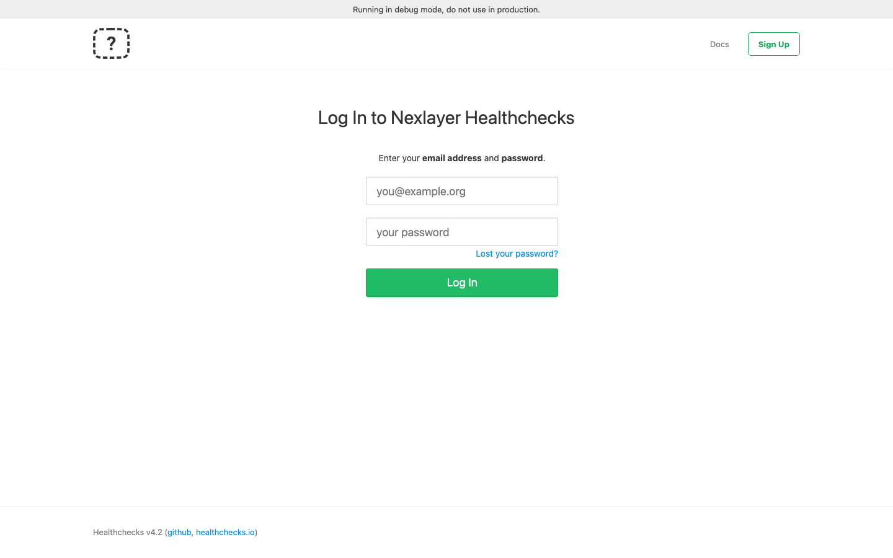

Nexlayer.com
#60 https://github.com/armondhonore/healthchecks

LIVE URL: https://relaxed-weasel-healthchecks.cloud.nexlayer.ai

Cron jobs fail silently — until they don't, at 3am, in production. Healthchecks is a dead-man's-switch monitor: your jobs ping a URL, and you get alerted when they go quiet. One Django container on SQLite, total peace of mind.

#250apps #nexlayer #monitoring #python #opensource

